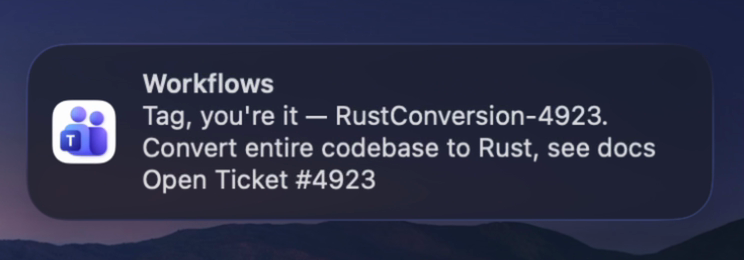
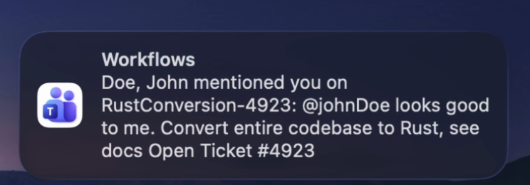
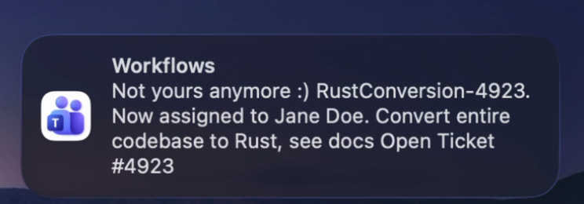

<p align="center"></p>

<p align="center"><samp>a Teams DM when Jira actually needs me</samp></p>

<p align="center"><code>MIT</code> <code>python 3.12</code> <code>one dependency</code> · <samp><a href="https://github.com/godfreyponce">github</a> / <a href="https://www.linkedin.com/in/godfreyponce/">linkedin</a> / <a href="https://godfreyponce.dev">personal website</a></samp></p>

I wanted to know what tickets were assigned to me and to be the one on top of
them. My first try was a Jira folder in Outlook, since Jira already emails you
about everything. That didn't work. I had to remember to navigate to the folder,
the formatting of Jira's emails is horrible, and it piled up with things from
last week when all I really needed was what's relevant on my tickets now. So why
not put it in our main communication instead? I found out Teams has automation
similar to Apple Shortcuts, played around with it, and got it sending alerts
straight to me. Teams stays on at all times, on every desktop I use and on my
Mac. What better place for Jira news to live than the main source of
communication on our team.

It polls Jira Data Center as me every 5 minutes, from a timer on my own Mac.
No server, no Jira admin rights. Three kinds of change count:

## 01 · comments

Someone comments on a ticket assigned to me. I get their name and a snippet.
My own comments never alert: my words are noise, not news. Tickets I merely
watch or reported do not alert either. They proved too noisy.

## 02 · mentions

An @mention anywhere, even on tickets I have never touched. This one leans
on Jira's comment text search, and if the server's text index rejects the
query, it degrades gracefully to my assigned set.

<p align="center"></p>
<p align="center"><sub><samp>real banner, fake data. john doe approves.</samp></sub></p>

## 03 · assignments

A ticket lands on my plate: "Tag, you're it". A ticket leaves: "Not yours
anymore :)", with who has it now. Detected by diffing the current assignment set
against the last cycle's, so a missed run never loses an assignment change.

<p align="center"></p>
<p align="center"><sub><samp>jane doe's problem now.</samp></sub></p>

https://github.com/user-attachments/assets/4fbbbf7b-04a3-4305-a98f-e6482184a7be
<p align="center"><sub><samp>the entire user interface. there is no screen two.</samp></sub></p>

## how it works

```
launchd, every 300 seconds
  └─ python -m src.run          one cycle, about 15 seconds, nothing stays resident
       ├─ JQL: assignee = currentUser()
       ├─ JQL: comment ~ my username     (best effort, degrades gracefully)
       ├─ diff assignments, dedup comments against state.json
       └─ flat six-field payload ─► Teams webhook ─► Power Automate ─► my chat
```

619 lines of Python, one dependency (`requests`). The Teams sink is one
function in a 22-line file, so swapping in ntfy or email is a one-file change.

## what it refuses to send

- The backlog. The first run seeds silently: it records everything it sees and
  says nothing. The live seed absorbed 42 existing assignments without a single
  ping.
- Bursts. More than 10 cards in one cycle collapses into a single digest. One
  early burst of about 42 cards taught it that restraint.
- My own comments, anywhere, ever.

## set it up

> [!NOTE]
> The full walkthrough is [docs/ONBOARDING.md](docs/ONBOARDING.md): Jira token,
> user key, the Power Automate flow, the timer. Budget about 30 minutes. Nothing
> needs admin rights.

```bash
cp .env.example .env      # five values, all yours
pip install -r requirements.txt
python -m src.run         # first run seeds silently, no backlog flood
./scripts/send-test.sh    # fires a fake alert at your webhook
```

## tradeoffs I chose

- About 5 minutes of latency. Instant needs an admin webhook and a public
  listener. Polling needs neither.
- No alerts while my Mac sleeps. The next cycle catches up. This started on
  GitHub's cron, which delivered about one run per hour against a nominal
  twelve, so the timer moved home.
- Mention search leans on Jira's text index. If the server rejects it, alerts
  fall back to my assigned tickets.
- No test suite. Verification is a real run with live credentials.

More detail, including the one-pager for non-technical visitors:
[site](https://godfreyponce.github.io/Jira-Alerts/) ·
[docs/](docs/)

<sub>MIT © 2026 Godfrey Ponce</sub>
